# MySerial

Serial port assistant based on Qt6

## Qt Dependence

- Widgets
- Charts
- SerialPort
- Network

## document

- [Easy](doc/document_easy.md)
- [Expert](doc/document_expert.md)
- [Produce](doc/document_produce.md)

## mode

### Easy

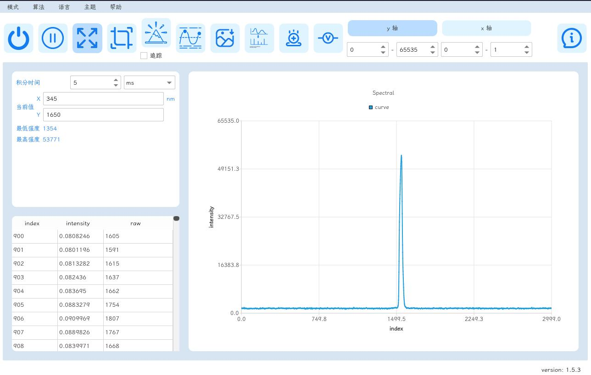

### Expert

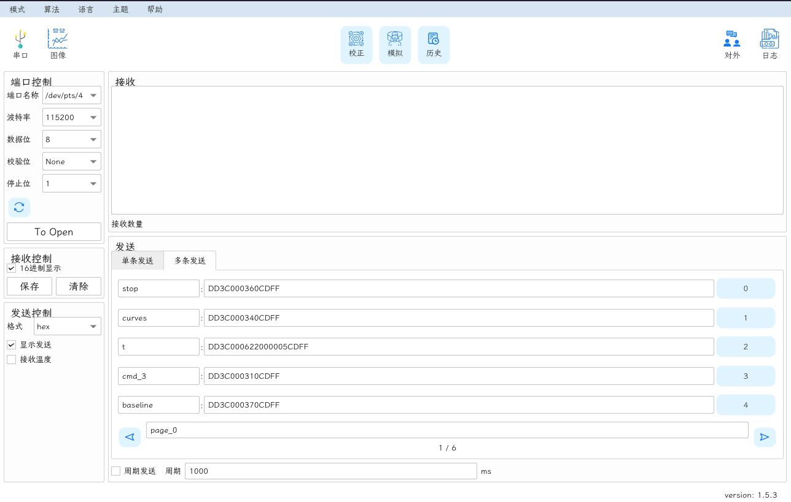

### Produce

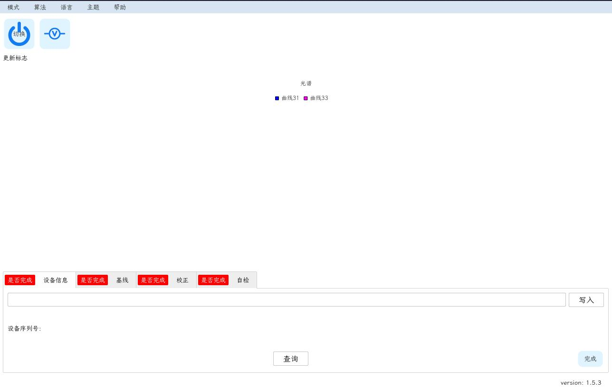

## Function

### Serial

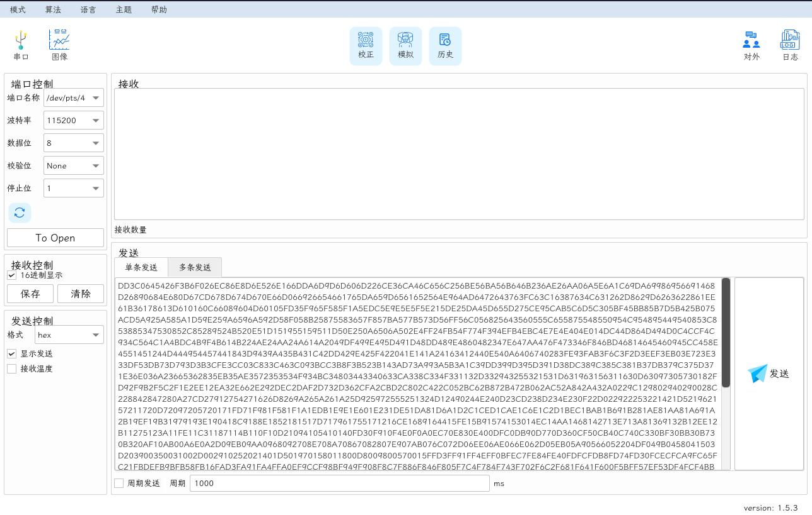

### Plot

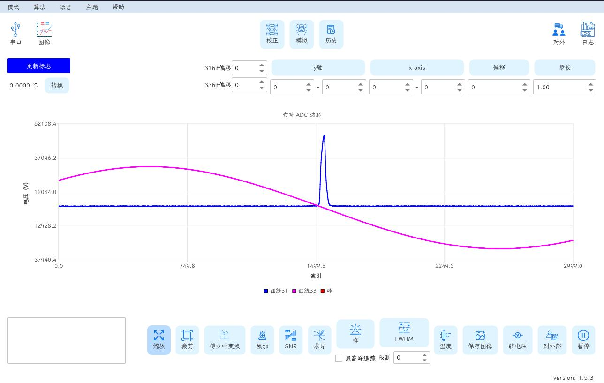

### Correction

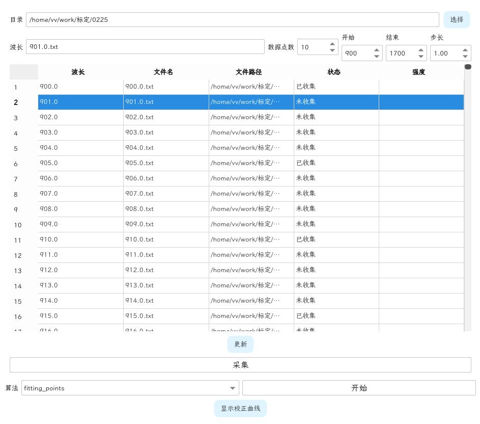

### History

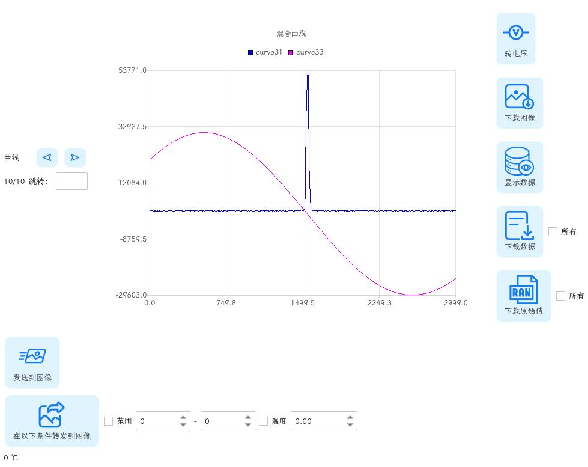

#### SNR

信噪比计算

##### signal / std(noise)

1. 首先找最大点
2. 将最大点左10个点，右10个点排除，其余为噪声
3. 计算噪声平均值，噪声标准差，线性信噪比（信号相对于噪声的强度比例），转换为dB

SNR = 信号强度 / 噪声标准差

| SNR(dB)   | 质量 |
| :-------- | :--- |
| <10 dB    | 很差 |
| 10–20 dB  | 可用 |
| 20–30 dB  | 良好 |
| 30–40 dB  | 很好 |
| 大于40 dB | 极好 |

##### mean(signal) / std(signal)

SNR = mean(signal) / std(signal)

### Log

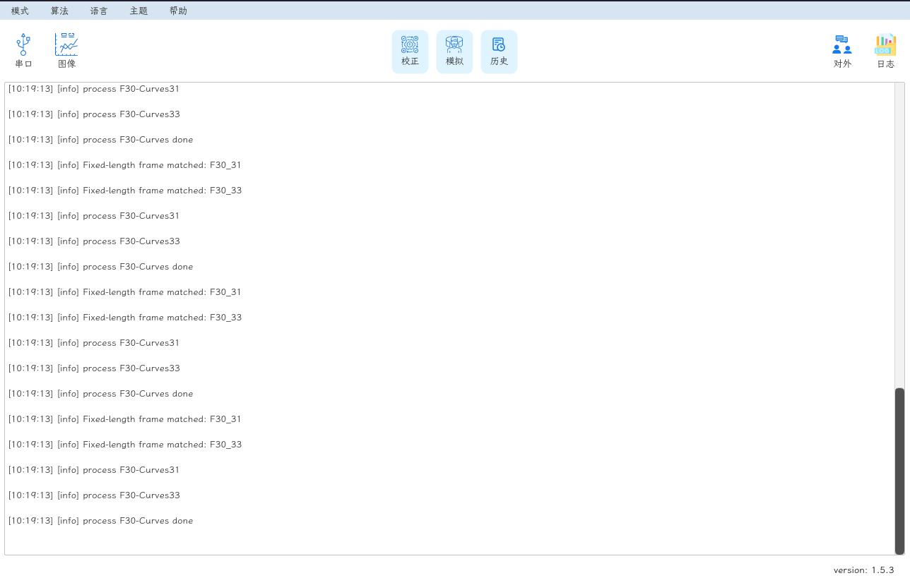

### Setting

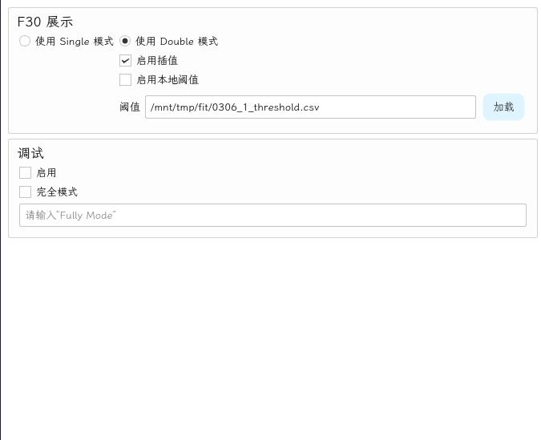

### Update

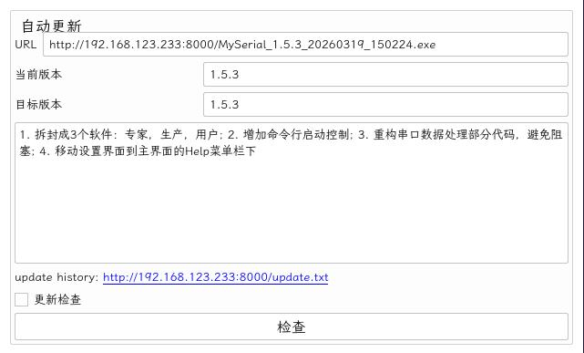

### Theme

Dark

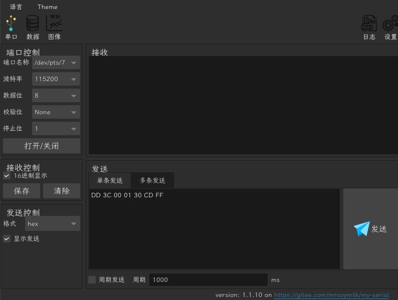

Lite

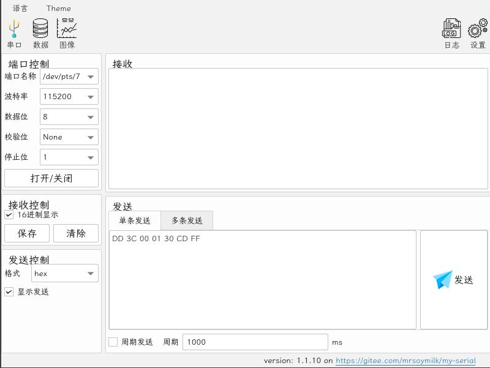

OSX Dark

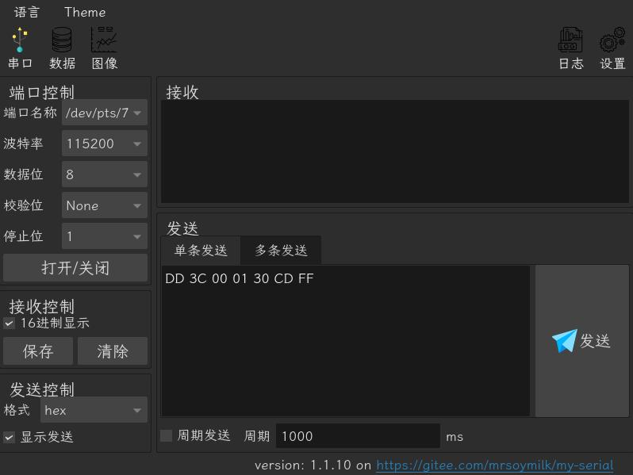

OSX Lite

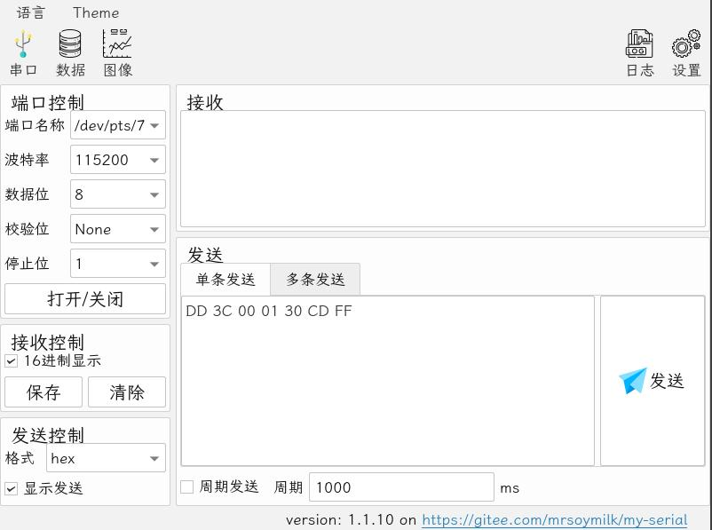

HelloKitty


## Tool

Dependence

```bash
pip install -r tool/requirements.txt
```

`show_smoothed.py`: find peak and show (`correction/*.csv`)

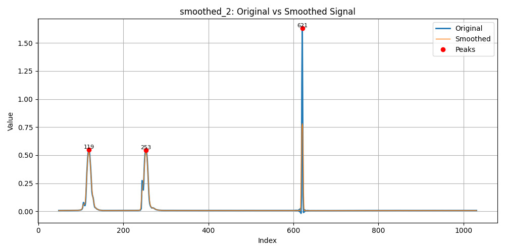
