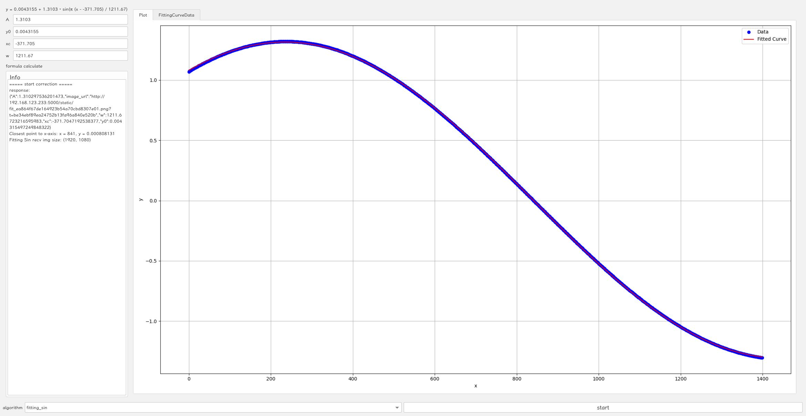
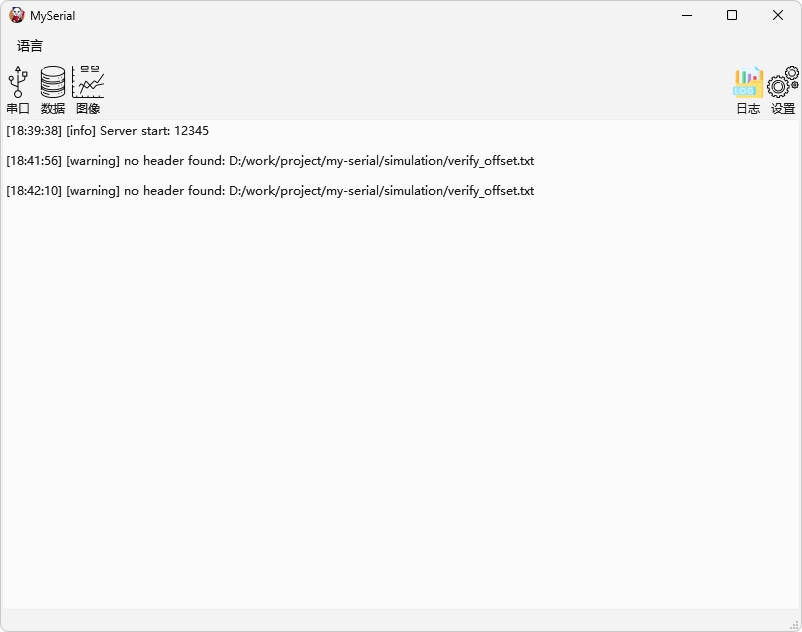
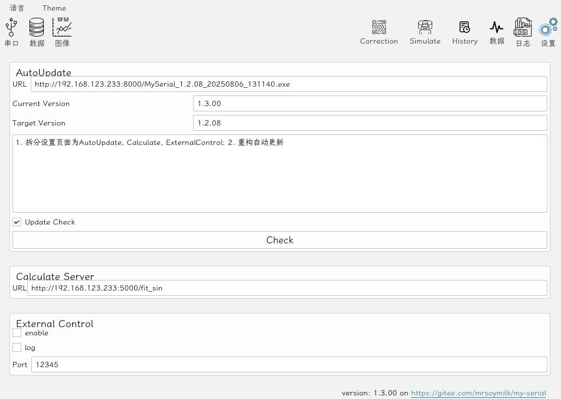
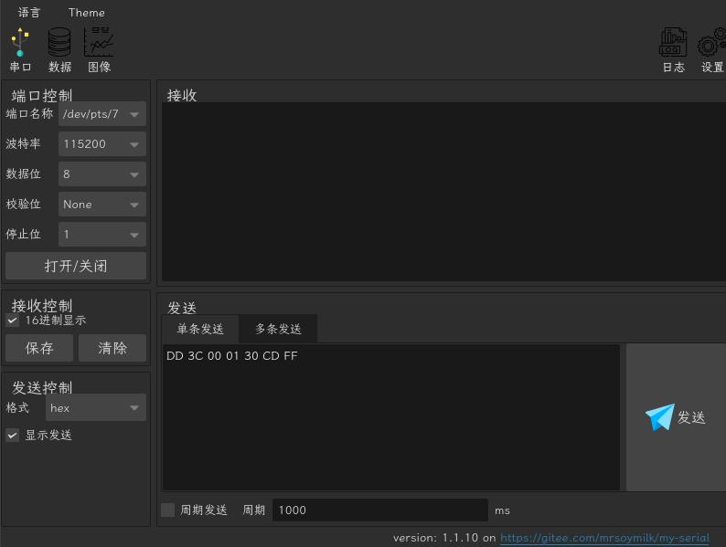
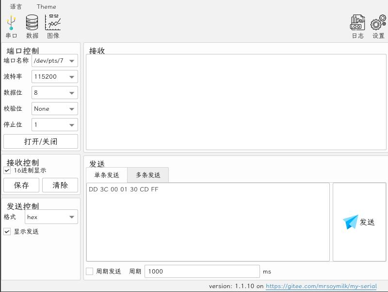
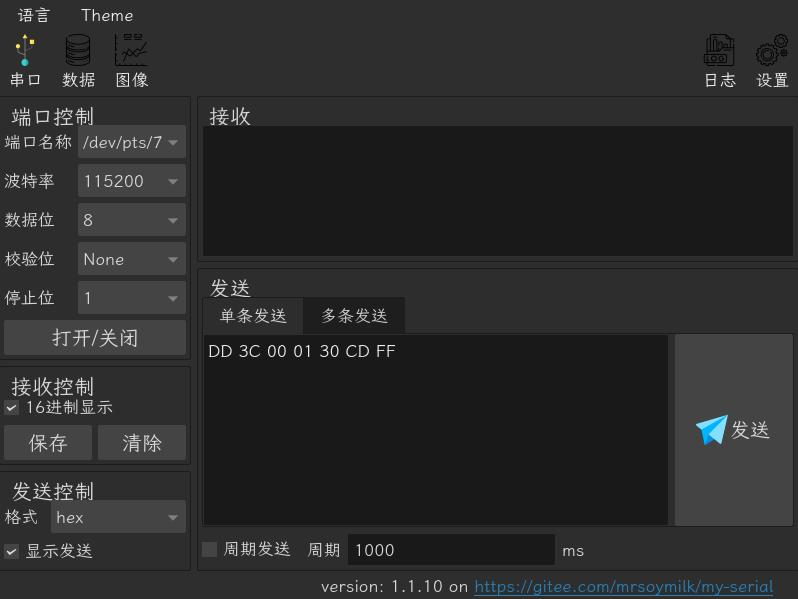
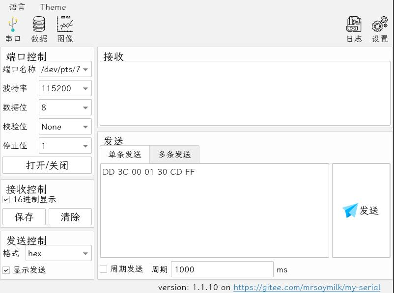

# MySerial

Serial port assistant based on Qt6

## Qt Dependence

- Widgets
- Charts
- SerialPort
- Network

## Function

### Serial


### Data


### Plot


Correction



### Log



### Setting



### Theme

Dark



Lite



OSX Dark



OSX Lite



## Tool

Dependence

```bash
pip install -r tool/requirements.txt
```

`show_smoothed.py`: find peak and show (`correction/*.csv`)


