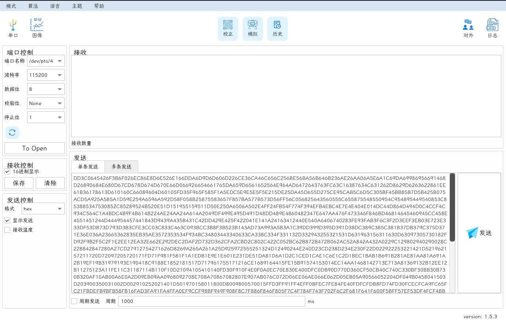
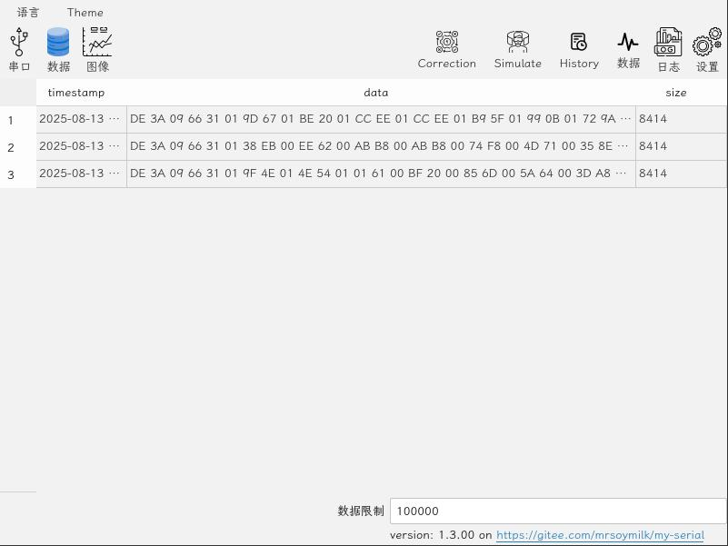
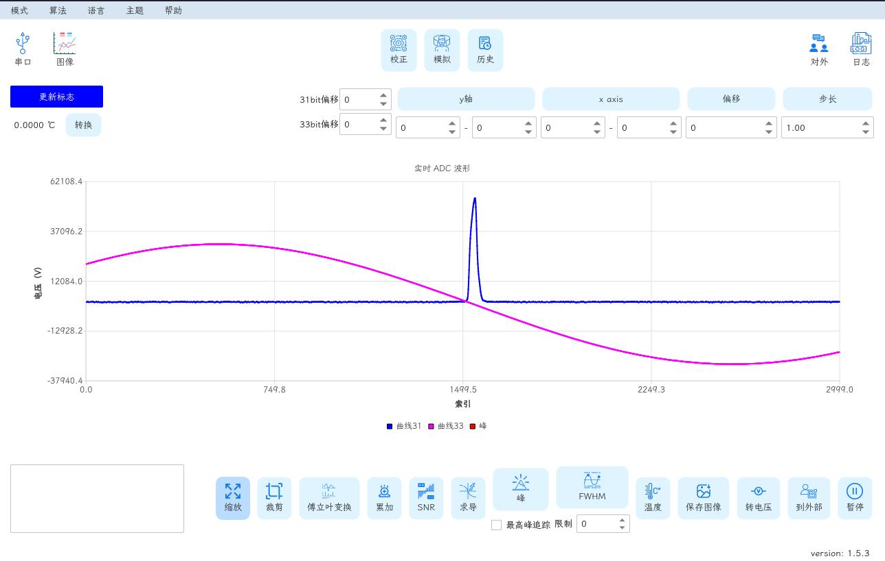
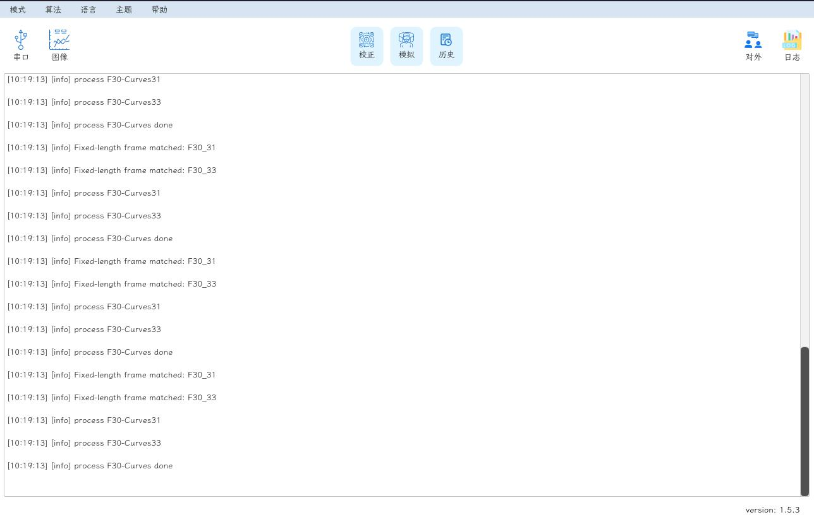
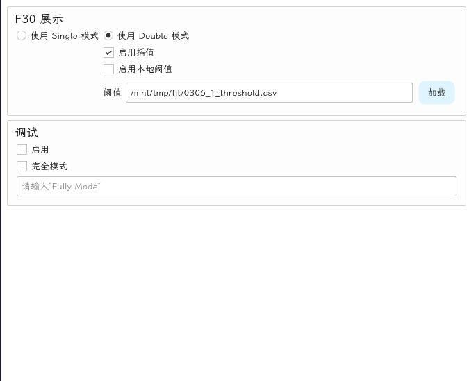

# MySerial

Serial port assistant based on Qt6

## Qt Dependence

- Widgets
- Charts
- SerialPort
- Network
- DataVisualization

## Function

### Serial

### Data

### Plot

### Log

### Setting

