# 用户模式

|      |            |
| :--- | :--------- |
| 版本 | 1.5.3      |
| 时间 | 2026/03/20 |

- [用户模式](#用户模式)
  - [1. 菜单栏选择区](#1-菜单栏选择区)
    - [帮助-更新](#帮助-更新)
  - [2. 操作区](#2-操作区)
    - [自动连接](#自动连接)
    - [暂停](#暂停)
    - [自动缩放](#自动缩放)
    - [裁剪](#裁剪)
    - [寻峰](#寻峰)
    - [半高宽测算](#半高宽测算)
    - [保存图像](#保存图像)
    - [傅立叶滤波](#傅立叶滤波)
    - [累加](#累加)
    - [电压转换](#电压转换)
    - [轴控制](#轴控制)
    - [额外功能-模拟](#额外功能-模拟)
    - [额外功能-历史](#额外功能-历史)
    - [额外功能-信噪比](#额外功能-信噪比)
    - [额外功能-暗光谱](#额外功能-暗光谱)
    - [额外功能-多点追踪](#额外功能-多点追踪)
  - [3. 积分设置与信息区](#3-积分设置与信息区)
  - [4. 当前数据区](#4-当前数据区)
  - [5. 光谱曲线展示区](#5-光谱曲线展示区)

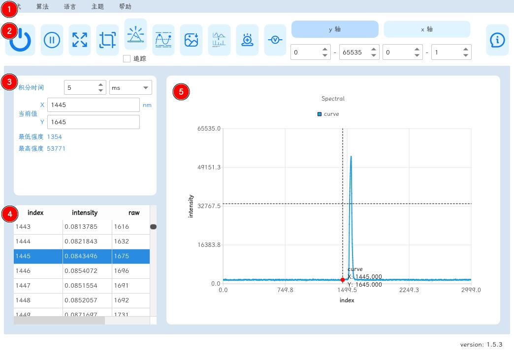

1. 菜单栏选择区
2. 操作区
3. 积分设置与信息区
4. 当前数据区
5. 光谱曲线展示区

## 1. 菜单栏选择区

- 模式：完全模式下出现，用于切换至其他模式
- 算法：完全模式下出现，用于切换至其他算法
- 语言：当前支持英文/中文/繁体中文
- 主题：当前支持蓝色/亮色/暗色/HelloKitty
- 帮助：提供文档支持/设置/更新

### 帮助-更新

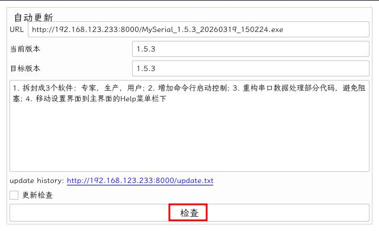

点击检查进行更新操作

## 2. 操作区

### 自动连接

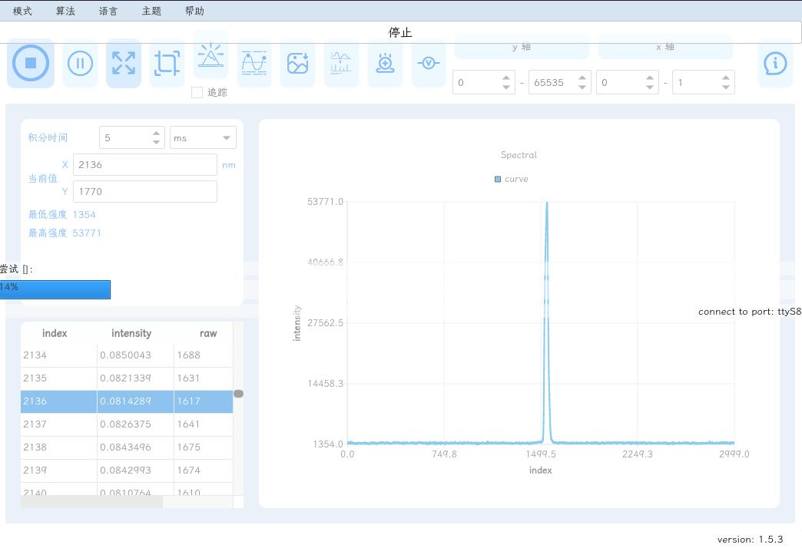

### 暂停

界面停止刷新，后台持续读取串口数据

### 自动缩放

### 裁剪

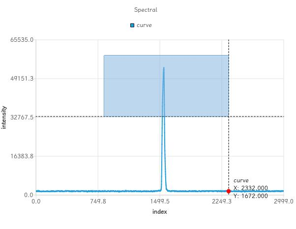

### 寻峰

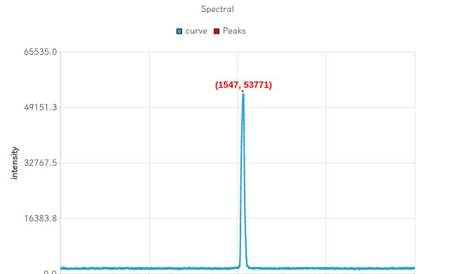

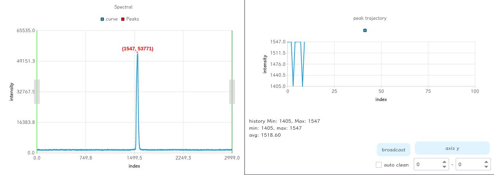

左右两侧调节线进行峰位筛选，如果范围内有多个峰，追踪值最大的点位

### 半高宽测算

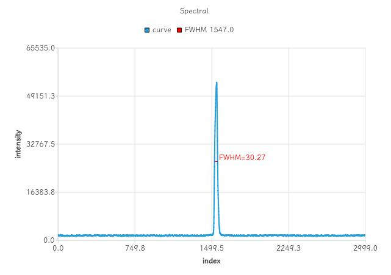

### 保存图像

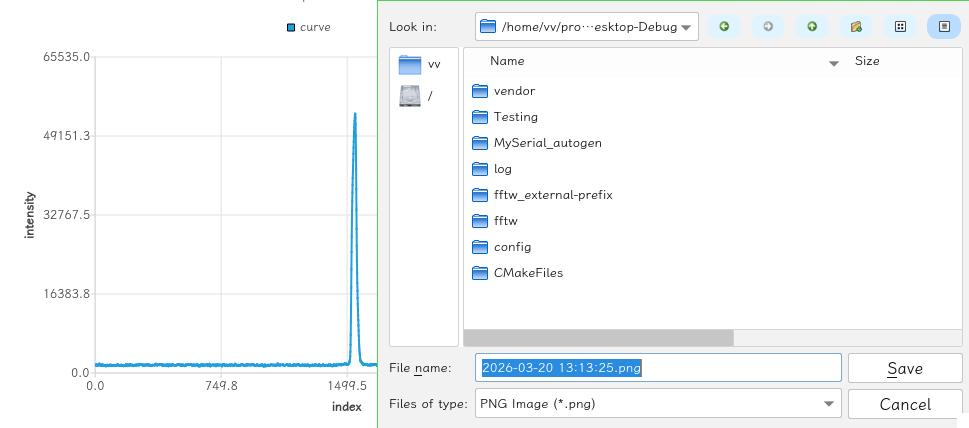

### 傅立叶滤波

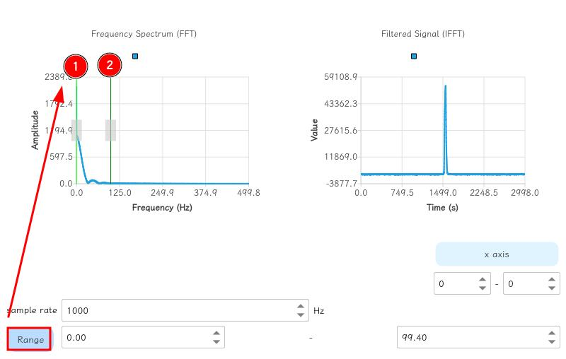

点击 `范围` 进行滤波

1. 带通频率起始
2. 带通频率结束

### 累加

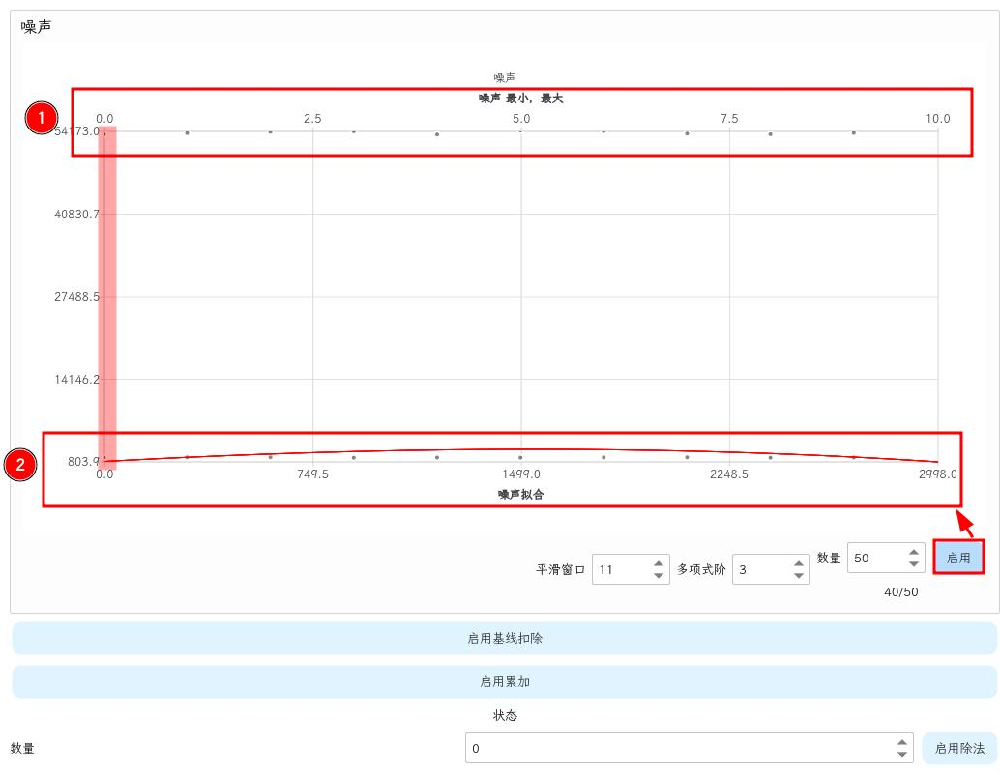

点击`启动`进行噪声曲线，其中顶部为`噪声 最小，最大`的x轴，每条曲线仅展示最大最小值，以次数为轴；底部为`噪声拟合`的x轴

1. 散点图：噪声最大值
2. 散点图：噪声最小值

### 电压转换

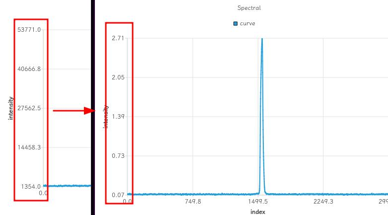

将ADC原始值转换为电压

### 轴控制

### 额外功能-模拟

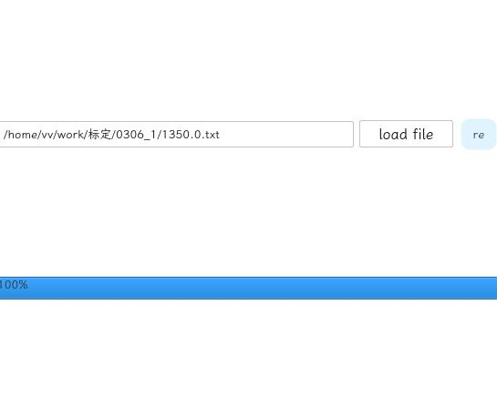

### 额外功能-历史

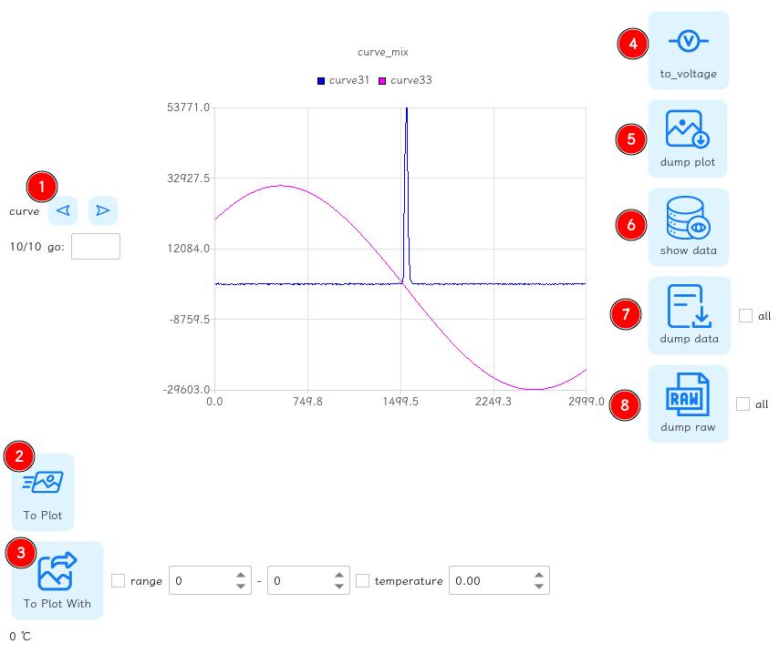

1. 翻页功能
2. 将当前图像发送到主界面上进行复杂处理
3. 将多个图像以后续条件（范围选择，温度控制）发送到主界面上进行复杂处理
4. Y轴转电压
5. 下载当前曲线为图片
6. 显示当前曲线的表格数据
7. 下载当前曲线的表格数据
8. 下载当前曲线的原始数据

### 额外功能-信噪比

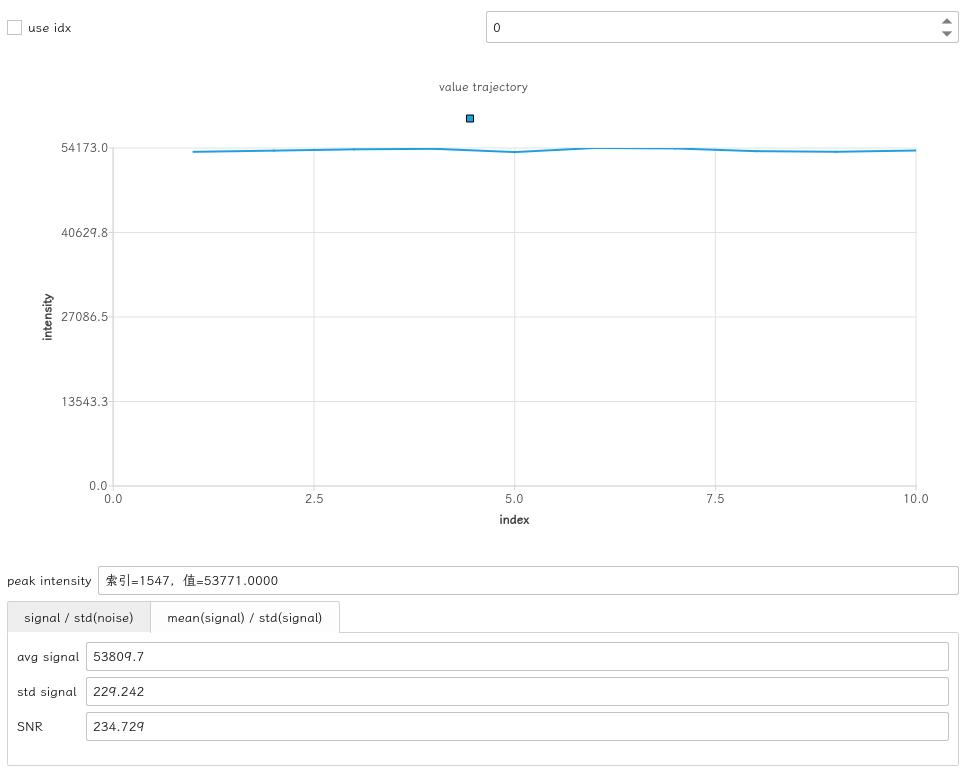

### 额外功能-暗光谱

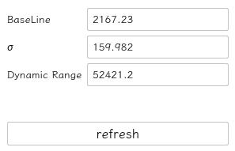

### 额外功能-多点追踪

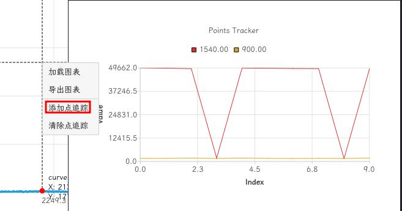

## 3. 积分设置与信息区

1. 积分时间设置
2. 点击光谱曲线后显示目标点位的相关信息

## 4. 当前数据区

以列表形式展示光谱曲线数据

## 5. 光谱曲线展示区

以图表形式展示光谱曲线数据
