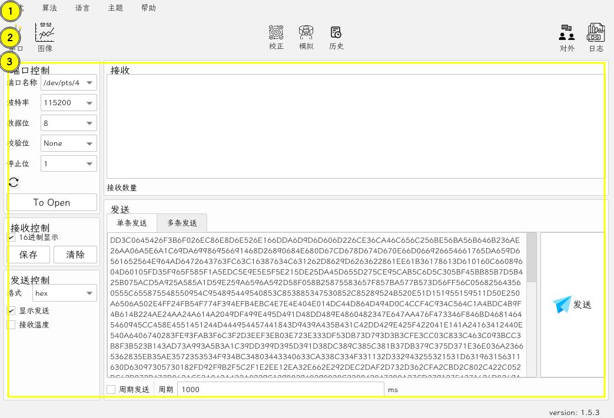
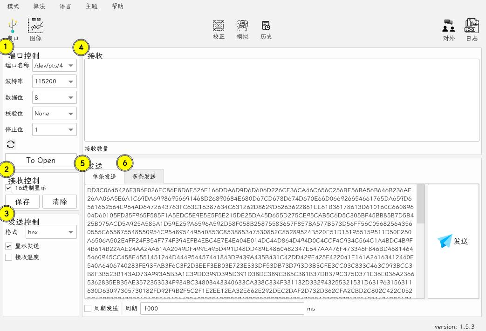
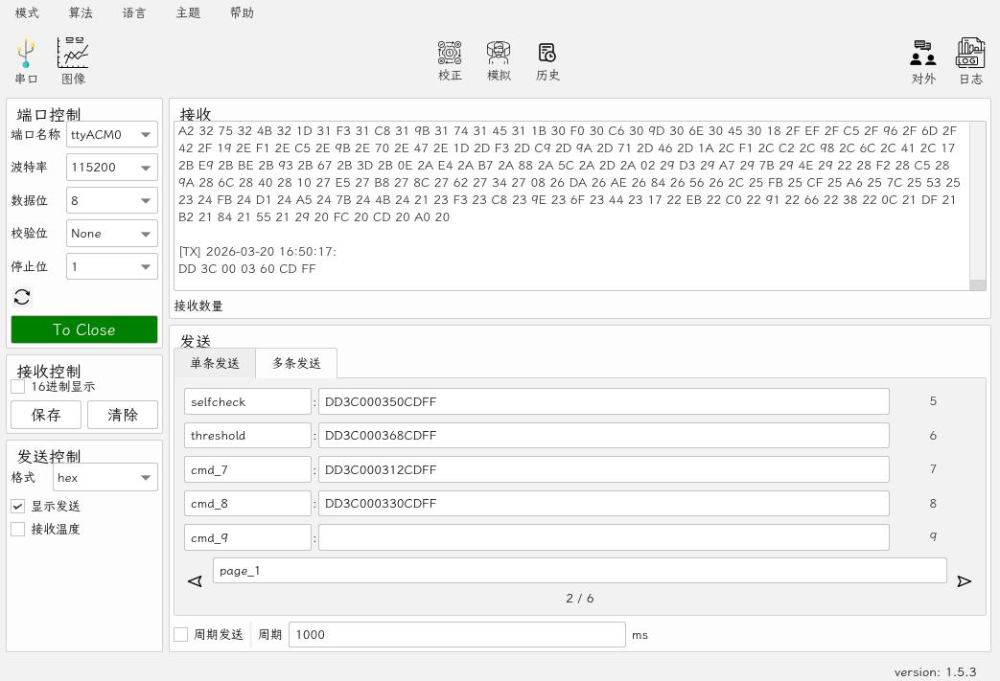
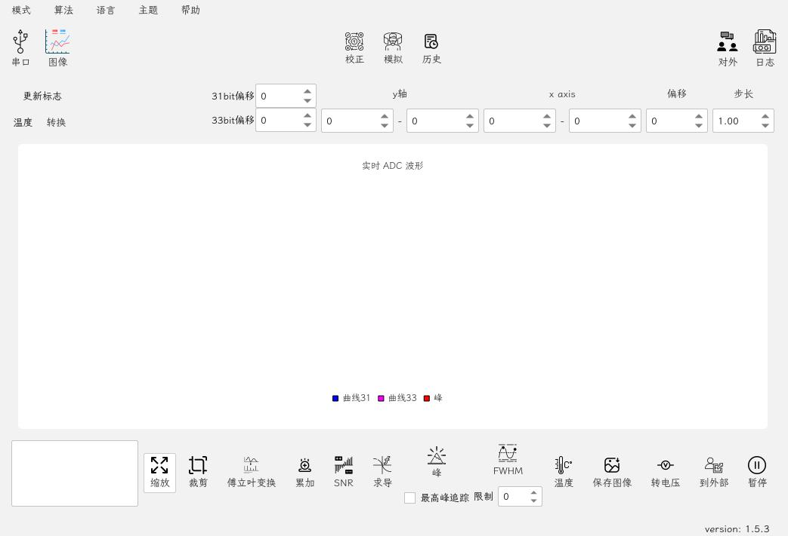
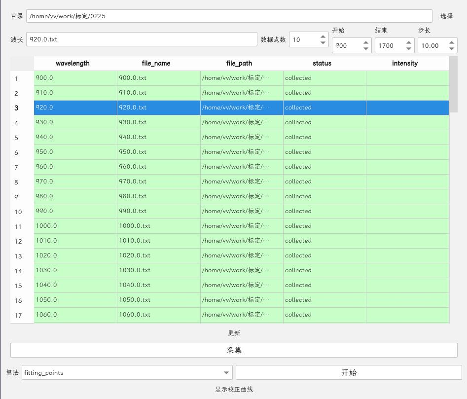
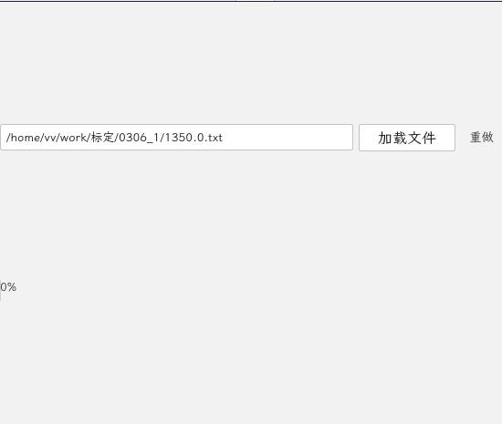
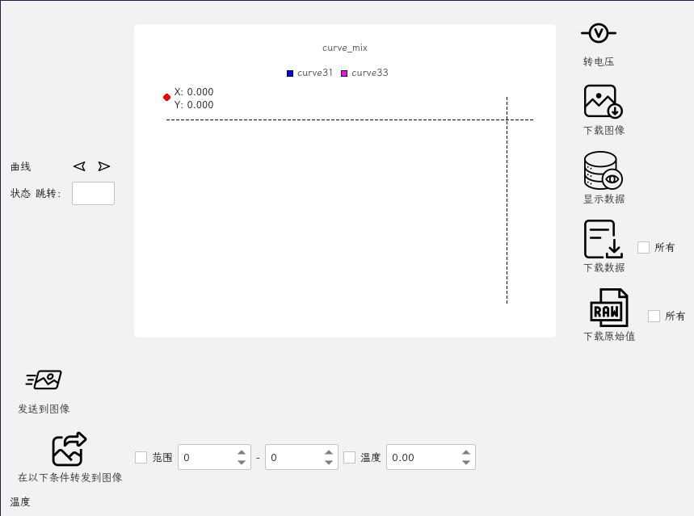
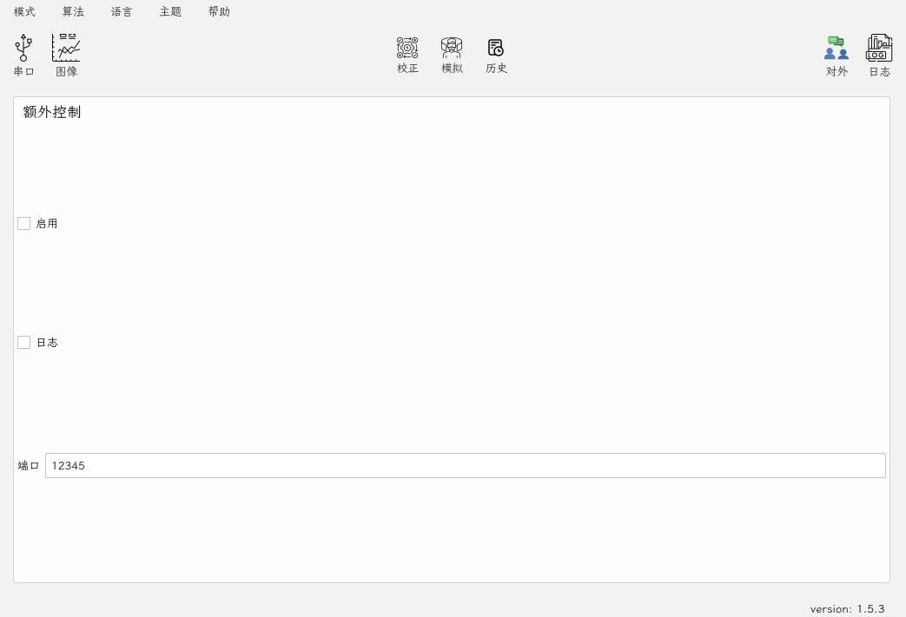
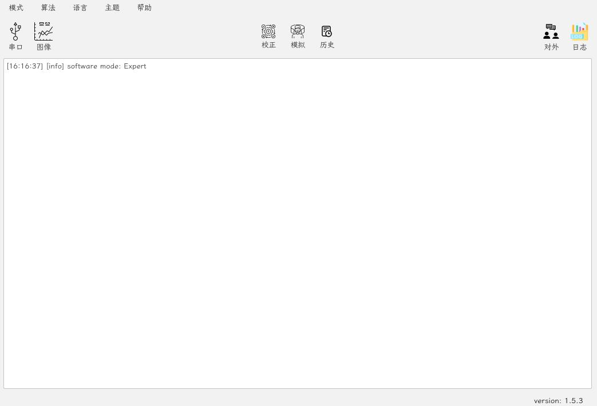

# 专家模式

串口操作部分对标正点原子的串口助手

|      |            |
| :--- | :--------- |
| 版本 | 1.5.3      |
| 时间 | 2026/03/20 |



1. 菜单栏选择区
2. 操作区
3. 具体内容区（对应操作区）

## 1. 菜单栏选择区

- 模式：完全模式下出现，用于切换至其他模式
- 算法：完全模式下出现，用于切换至其他算法
- 语言：当前支持英文/中文/繁体中文
- 主题：当前支持蓝色/亮色/暗色/HelloKitty
- 帮助：提供文档支持/设置/更新

## 2. 操作区

### 串口操作



#### 1. 端口控制

使用刷新按钮进行端口刷新，其他按需进行配置

#### 2. 接收控制

`16进制显示`：默认只显示发送，勾选后显示接收

点击`保存`将接收窗口数据下载到本地

点击`清除`将接收窗口数据清除

#### 3. 发送控制

格式：

- normal：发送常规字符串
- hex：发送对应的16进制字符

#### 4. 接收数据窗口

接收数据存在限制，否则会拖慢程序速度

#### 5. 单条发送窗口

#### 6. 多条发送窗口



格式如下：

```bash
[名称] [指令] [发送按钮]
```

### 图像操作



### 校正操作

#### 使用多个点拟合进行校正



### 模拟操作



### 历史操作



### 对外操作



### 日志操作


