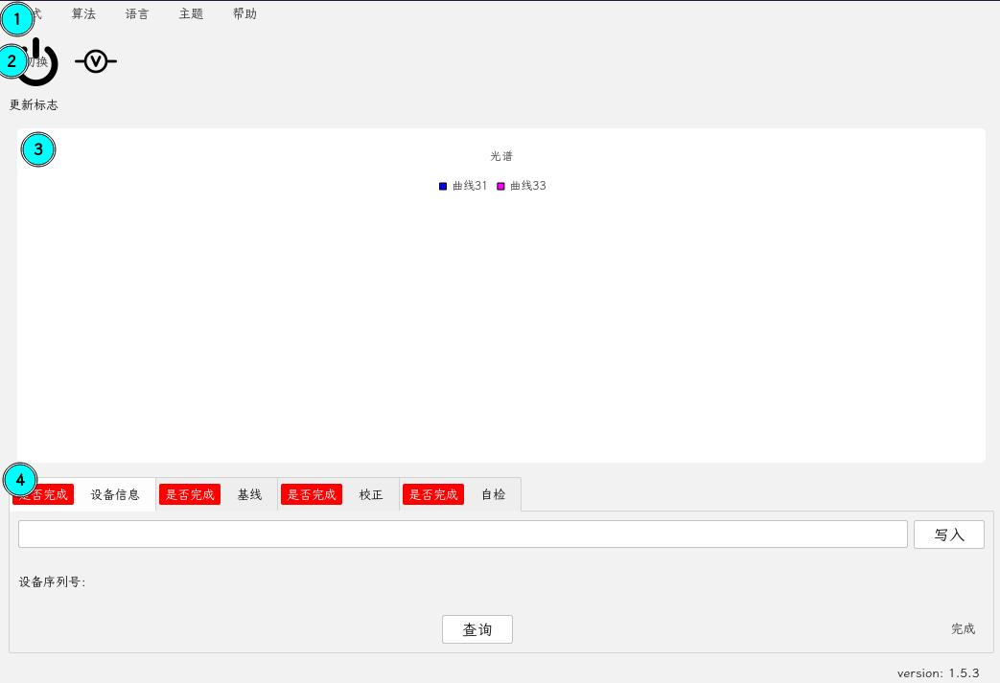
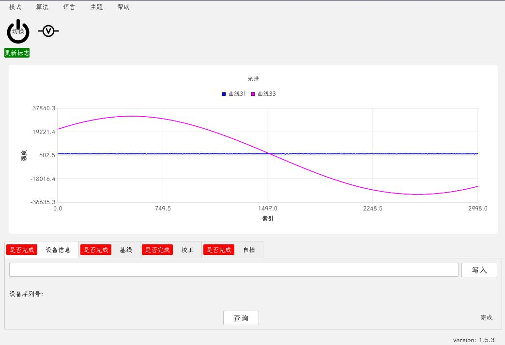
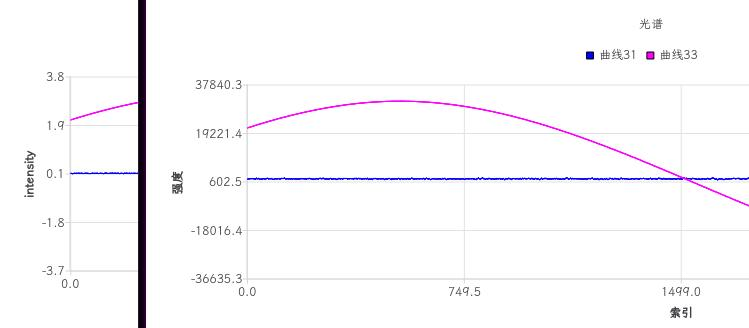
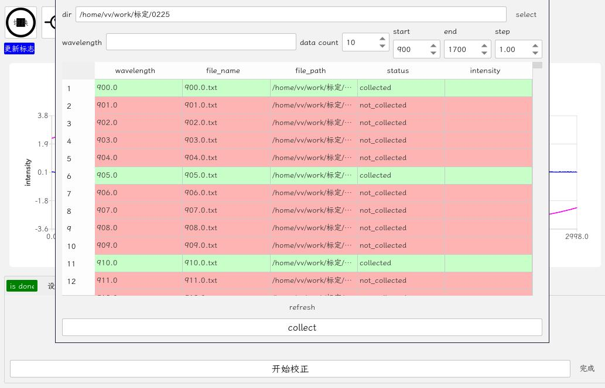
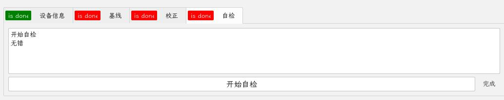

# 生产模式

|      |            |
| :--- | :--------- |
| 版本 | 1.5.3      |
| 时间 | 2026/03/20 |

- [生产模式](#生产模式)
  - [1. 菜单栏选择区](#1-菜单栏选择区)
  - [2. 操作区](#2-操作区)
    - [自动连接](#自动连接)
    - [电压转换](#电压转换)
  - [3. 光谱曲线展示区](#3-光谱曲线展示区)
  - [4. 生产操作区](#4-生产操作区)
    - [设备信息](#设备信息)
    - [基线](#基线)
    - [校正](#校正)
    - [自检](#自检)

1. 菜单栏选择区
2. 操作区
3. 光谱曲线展示区
4. 生产操作区

## 1. 菜单栏选择区

- 模式：完全模式下出现，用于切换至其他模式
- 算法：完全模式下出现，用于切换至其他算法
- 语言：当前支持英文/中文/繁体中文
- 主题：当前支持蓝色/亮色/暗色/HelloKitty
- 帮助：提供文档支持/设置/更新

## 2. 操作区

### 自动连接

### 电压转换

将ADC原始值转换为电压

## 3. 光谱曲线展示区

以图表形式展示光谱曲线数据

## 4. 生产操作区

### 设备信息

- 点击`查询`进行设备序列号查询
- 点击写入，将输入栏中的序列号写入设备

### 基线

- 点击`查询`进行基线查询
- 点击写入，将输入栏中的基线写入设备

### 校正

点击`开始校正`进行设备校正，需要完成以下操作：

1. 采集相关数据
2. 收集波长与强度关系
3. 生成对应阈值表
4. 写入设备

### 自检

点击`开始自检`进行设备自检
