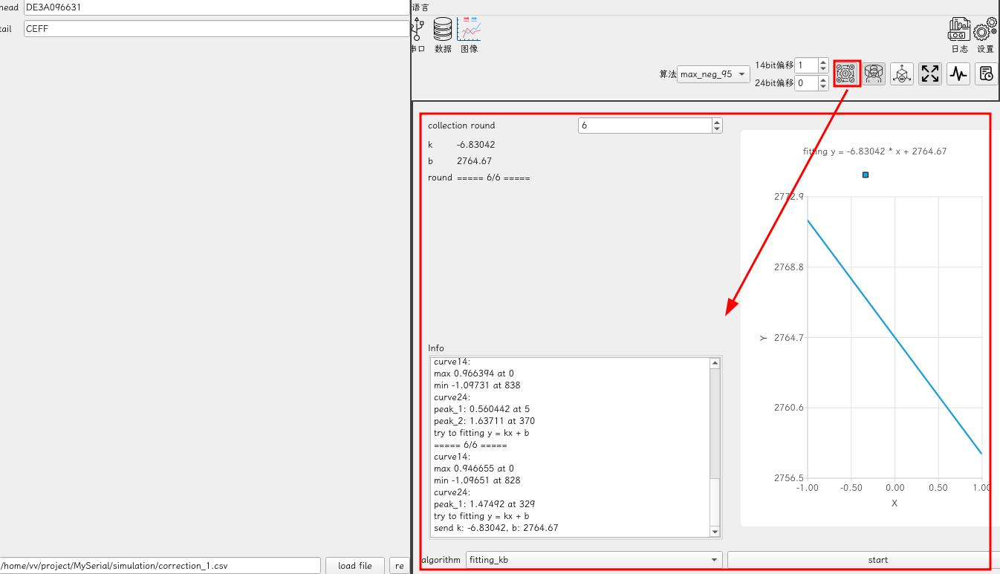
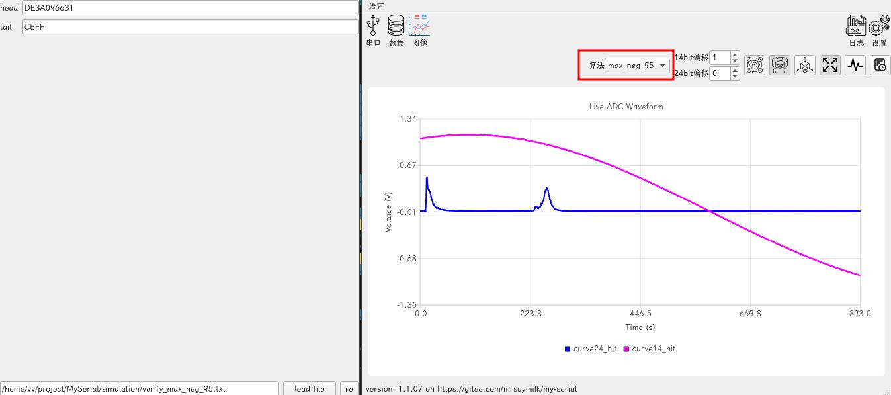
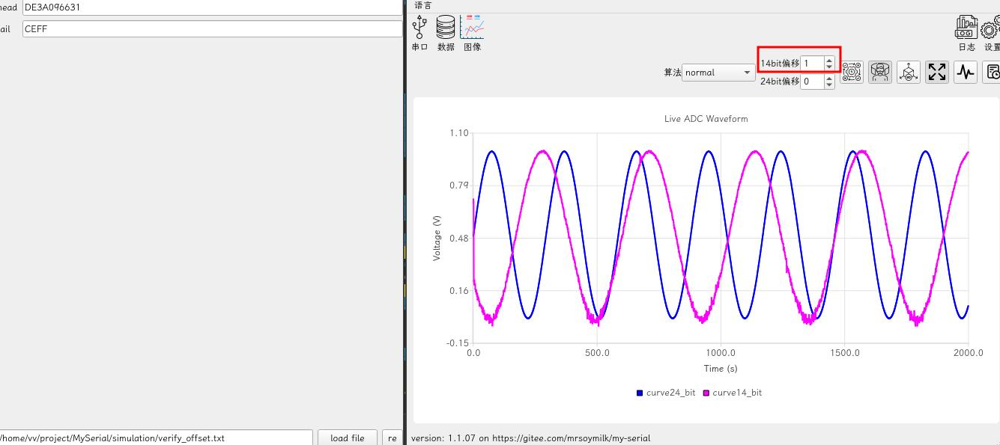

## `cut_csv.py`

default usage:

```bash
python cut_csv.py --file your.csv
```

## `cut_txt.py`

default usage:

```bash
python cut_txt.py --file your.txt
```

## `main.py`

default usage:

```bash
python3 main.py --port /dev/pts/your_port
```

## File Usage

### `correction.csv`, `correction_1.csv`



### `verify_max_neg_95.txt`



### `verify_offset.txt`


